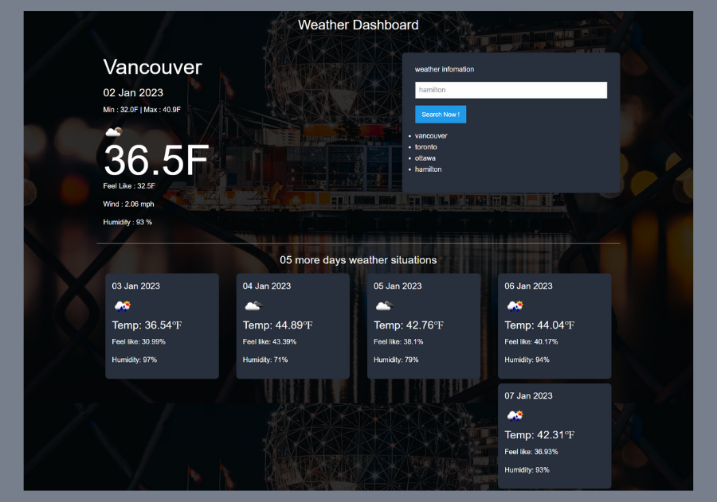

# Weather Dashboard

       
## 🌟[Description](#table-of-contents)
A weather dashboard application that displays current weather and 5-day forecast for a city.

<p>
    
    
    
    
    
    
    
</p>

## Table-of-Contents
* [Description](#description)
* [Submission](#Submission)
* [User Story](#User-Stor)
* [Acceptance Criteria](#Acceptance-Criteria)
* [Mock-Up](#Mock-Up)
* [License](#License)
* [Contributing](#contributing)
* [FAQs](#faqs)
  
## 🚀 [Submission](#table-of-contents)

Deployed URL: https://vimukthigunasekara.github.io/weather-dashboard/
<br>
GitHub Repo URL: https://github.com/VimukthiGunasekara/weather-dashboard


## 👤 [User Story](#table-of-contents)

``` 
AS A traveler
I WANT to see the weather outlook for multiple cities
SO THAT I can plan a trip accordingly
```


## 🔑 [Acceptance Criteria](#table-of-contents)

```
GIVEN a weather dashboard with form inputs
WHEN I search for a city
THEN I am presented with current and future conditions for that city and that city is added to the search history
WHEN I view current weather conditions for that city
THEN I am presented with the city name, the date, an icon representation of weather conditions, the temperature, the humidity, and the wind speed
WHEN I view future weather conditions for that city
THEN I am presented with a 5-day forecast that displays the date, an icon representation of weather conditions, the temperature, the wind speed, and the humidity
WHEN I click on a city in the search history
THEN I am again presented with current and future conditions for that city
```

## 📺 [Mock-Up](#table-of-contents)


         
## 📑 [License](#table-of-contents)


Your repository is licensed under an mit open source license, so other people can contribute more easily.More information can be found by clicking this [link.](https://choosealicense.com/licenses/mit)

## 🤝 [Contributing](#table-of-contents)
We are open to all kinds of contributions. If you want to:
* 🤔 Suggest a feature
* 🐛 Report an issue
* 📖 Improve documentation
* 👨‍💻 Contribute to the code

We are excited that you are reading this and are willing to contribute. No need to think big. Even a typo fix might save our day and make you a hero. Every contribution counts!
     
Feel free to check [issues page](https://github.com/VimukthiGunasekara/weather-dashboard/issues) 
     
## 🤔 [FAQs](#table-of-contents)
Please contact me using the following links:

[GitHub](https://github.com/VimukthiGunasekara) / Email: vimukthisadaruwan65@gmail.com
